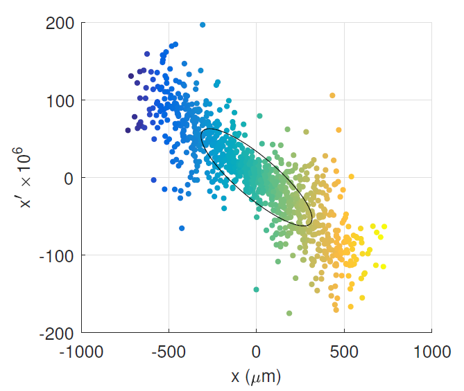
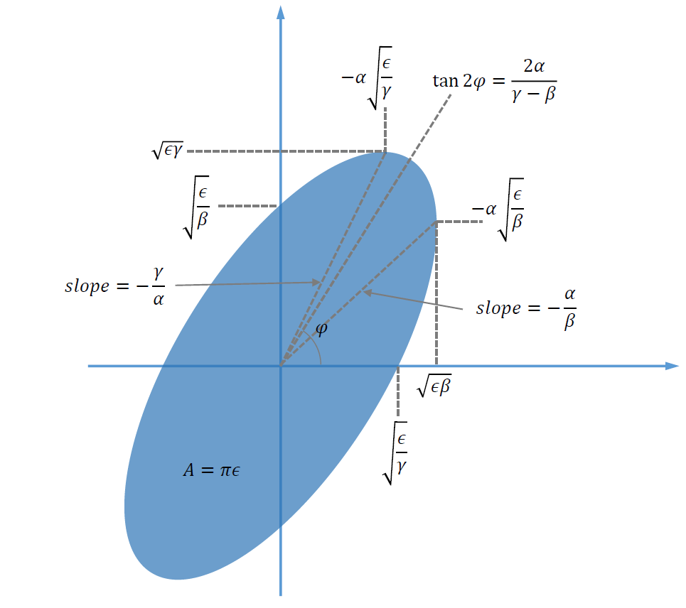

# Twiss Parameter Dashboard

This repository is for an interactive dashboard that can be found [here](https://twiss-parameter-dashboard.onrender.com). The dashboard is an educational tool for developing intuition for the meaning of Twiss parameters as used in particle accelerator physics. We include a brief introduction to Twiss parameters (also called [Courant-Snyder parameters](https://en.wikipedia.org/wiki/Courant%E2%80%93Snyder_parameters).

We can approximate particle distributions as 3 separate space-angle pairs, which do not have correlation between them: i.e. ($x$, $x^{\prime}$) and ($y$, $y^{\prime}$) and ($z$, $\delta$) where $x^{\prime}=\frac{dx}{dz}=\frac{v_x}{v_z}\approx\theta_x$ and $\delta=\frac{E-E_{mean}}{E_{mean}}$ with E the energy. For most beamlines, linear optics are sufficient to describe the processes in an accelerator, particularly at high energies, so we primarily deal with linear correlations in these phase-space pairs. As particle bunches can be made of millions or more particles, we simplify the mathematics by taking the RMS ellipse of the distribution.

 

<em>Particle distribution overlayed with its RMS phase space ellipse.</em>

 

For a phase space like $x$ - $x^{\prime}$, this reduces the number of parameters from 2 for each particle, down to 2 Twiss parameters and the geometric emittance, so 3 total for the entire dimension. This phase space ellipse is given by the equation below

$$
\begin{aligned} 
\gamma x^2 + 2\alpha x {x^\prime} + \beta {x^\prime}^2 = \epsilon
\end{aligned}
$$

where the two independent Twiss parameters are $\alpha$ and $\beta$ and the geometric emittance is $\epsilon$. The third Twiss parameter $\gamma$ is a combination of the first two and is given by $\gamma=\frac{1+\alpha^2}{\beta}$. We can see how the Twiss parameters relate to quantities in the RMS ellipse in the image below:

 

<em>Phase Space Ellipse and its relationship to the Twiss parameters.</em>

 

Of note is that $\alpha$ is related to the correlation between phase space and angle and $\beta$ is related to the RMS spatial extent. We can also recover the Twiss parameters from the 2x2 covariance matrix:

$$
\begin{aligned} 
\Sigma_x = Cov(x,x^{\prime})
    =
    \epsilon 
    \begin{pmatrix}
        \beta & -\alpha \\
        -\alpha & \gamma    
    \end{pmatrix}.
%
\end{aligned}
$$

This can be extended to all 3 phase spaces, yielding a 6x6 matrix, however, that is beyond the extent of the information covered here.

One quantity not yet mentioned is the normalized emittance. When the mean kinetic energy of the distribution increases $x^{\prime}$ decreases as $v_{z}$ increases, while $v_x$ remains the same; however, the spatial extent remains the same, meaning the area the ellipse covers, or the geometric emittance, must decrease as a result. The normalized emittance is constant for all energies and is given by

$$
\begin{aligned} 
\epsilon_n = \gamma^L\beta^L_z \epsilon
\end{aligned}
$$

where $\gamma^L=(1-\frac{v^2}{c^2})^{-\frac{1}{2}}$ is the Lorentz factor and $\beta^L_z=\frac{v_z}{c}$ is the velocity along $z$ normalized by the speed of light $c$. For the dashboard, we do not set these parameters directly; instead, the mean kinetic energy of the distribution in MeV. Large XFEL's like LCLS have operating energies of 10's of GeV, while the large circular collider at CERN operates at TeV. The machines we are interested run at 10's of MeV or about 1,000 times lower energy than LCLS and about 1,000,000 times lower energy than CERN. 

The units of emittance are m-radians, though we will use units of nm-rad for the dashboard as the beamlines we are interested in have fairly small emittances (10's of nm-rad rad vs 100's nm-rad for XFEL beamlines or 1,000's nm-rad or more for synchrotron beamlines).

